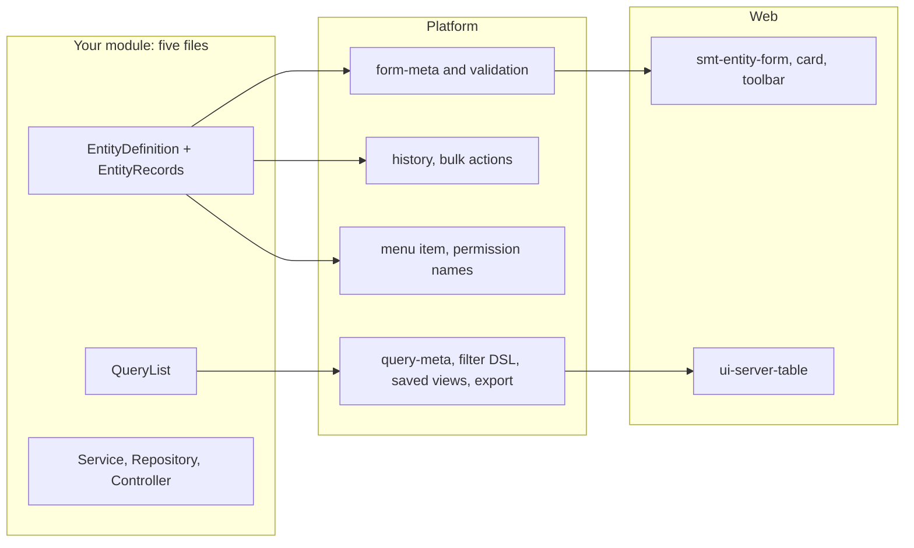

# SmartupCMS

SmartupCMS is a self-hosted **low-code CMS for developers**. You declare an
entity once on the server — its fields, rules, actions and the right each action
needs — and the platform builds the rest: the list with filters, sorting,
search, saved views and Excel export, the form and its validation, the record
card with its change history, bulk actions, the menu item and the permission
names. A module stays a handful of files; everything else comes from the
platform.

It ships as one product for one organization and many users: identity and
roles, tasks and projects, notes, files, search, notifications, audit and a
data-upload module, all built on the same platform. The interface speaks
Russian, Uzbek and English; an administrator adds more languages in the
language editor.

The project is pre-1.0. Use an immutable release tag and complete the
[production launch checklist](docs/ops/production-launch-checklist.md) before a
production rollout.

## What a developer writes

```text
scripts/dev/create-module.ps1 -ModuleName inventory -ModuleTitle "Склад"

V1xx__inventory_module.sql     table, module switch, role grants
MsInventoryQuery.java          the list: fields, filters, sort, search
MsInventoryEntity.java         the declaration: form, rules, actions, rights,
                               menu item, capabilities, and the records bean
MsInventoryService.java        saves checked by the declaration, audit
MsInventoryRepository.java     SQL
MsInventoryController.java     REST endpoints with @RequiresPermission
```

From the declaration the platform serves `GET /api/v1/form-meta/{code}`,
`GET /api/v1/query-meta/{code}` and `GET /api/v1/entities/menu`, and builds the
record history, the export and `POST /api/v1/entities/{code}/bulk`. The web
screen draws itself with `smt-entity-form`, `smt-entity-card`,
`smt-entity-toolbar` and `ui-server-table`.

Start with the [module development guide](docs/guidelines/module-development-guide.md)
and the [extension points](docs/architecture/extension-points.md). The notes
module is the reference implementation:
`apps/server/src/main/java/com/smartup24/cms/instance/ms/note` and
`apps/web/src/app/features/notes`.

## Product model

- One installation serves one organization; isolation between organizations is
  provided by separate installations and databases.
- The complete product is available in this repository under Apache-2.0.
- Self-hosted and Smartup-managed deployments use the same product. Commercial
  services may cover hosting, operations, support, and SLA.
- No telemetry, licensing callback, remote enrollment, or phone-home connection
  is enabled by default.
- Local disk and S3-compatible object storage are supported. Smartup-managed
  infrastructure targets Cloudflare R2; self-hosters may use AWS S3, R2, MinIO,
  Garage, or another compatible provider.

## Architecture

SmartupCMS is a modular monolith with separately deployable runtime containers:

| Component | Implementation | Responsibility |
|---|---|---|
| `web` | Angular 22 | Browser UI and the only public application origin |
| `server` | Java 25, Spring Boot 4.1, package `com.smartup24.cms` | APIs, authorization, platform and business modules, audit |
| `postgres` | PostgreSQL 18 | Transactional data and Flyway schema history; a second database keeps uploaded data |
| `typesense` | Typesense 27.1 | Full-text search |
| `backup` | PostgreSQL client, `age`, AWS CLI | Encrypted database backups and local status |



The web container proxies API traffic to the server. PostgreSQL, Typesense, and
management endpoints are not published by the production Compose topology.
Database migrations are a separate, fail-closed step. See the
[architecture overview](docs/ops/architecture-overview.md).

## Quick start

Prerequisites: JDK 25, Node.js from [`.node-version`](.node-version) with npm,
Docker with Docker Compose v2. Maven is not needed (the wrapper `./mvnw` is
used). Three commands from a clone to a working UI:

```bash
git clone <repository-url> smartupcms
cd smartupcms
scripts/dev/run-local.sh            # Windows: powershell -ExecutionPolicy Bypass -File scripts\dev\run-local.ps1
```

The script starts PostgreSQL (the main database and pg-dwh) and the mail stub
Mailpit in Docker Compose, builds the server, migrates both databases, starts
the server and `ng serve`, and prints the address. Open
<http://localhost:4200> and sign in as `admin` with the password the script
generated into `.local/admin-password` (ignored by git); the first sign-in asks
for a new one. Add `--demo` (`-Demo`) for demo users, projects, tasks, notes and
orders, `--detach` (`-Detach`) to get the prompt back, and stop everything with
`scripts/dev/run-local.sh down`. With GNU make: `make dev` (DevTools restarts
the server on recompile), `make demo`, `make stop`, `make help`. The dev
container in `.devcontainer/` brings the same tools.

### Run the containers

The images as they are deployed, with Docker Engine 26+ and Compose v2 only:

```bash
cp .env.example .env
docker compose run --rm migrate
docker compose up -d --wait
```

Open <http://localhost:4200>. The development defaults create the initial
administrator `admin` with the password in `ADMIN_PASSWORD`. Change it on first
sign-in. The defaults in `.env.example` are for local development only.

Stop the stack without deleting data:

```bash
docker compose down
```

The optional encrypted backup service requires secret files and an age
recipient. Follow the [deployment guide](docs/ops/deployment-guide.md) instead of
enabling it with development credentials.

## Development

Prerequisites: JDK 25, Maven 3.9+, Node.js from [`.node-version`](.node-version),
npm, and Docker for integration tests.

Backend verification:

```bash
mvn -B verify
```

Web verification:

```bash
cd apps/web
npm ci
npm run i18n:sync-ru
npm run i18n:audit
npm test
npm run typecheck
npm run build
```

End-to-end verification runs against the Compose deployment started in the
quick start:

```bash
cd e2e
npm ci
npx playwright install chromium
npm test
```

Read [onboarding](docs/onboarding.md) for the code map and
[CONTRIBUTING.md](CONTRIBUTING.md) before submitting a change.

Use the [documentation index](docs/README.md) to navigate authority levels and
the [canonical technical specification](docs/technical-specification.md) for
normative product and release requirements.

## Operations and security

- [Production deployment](docs/ops/deployment-guide.md)
- [Operations runbook](docs/ops/operations-runbook.md)
- [Smartup-managed infrastructure acceptance](docs/ops/managed-infrastructure-acceptance.md)
- [Backup, restore, and maintenance](docs/ops/maintenance-guide.md)
- [Rollback procedure](docs/ops/rollback.md)
- [Threat model and personal-data inventory](docs/security/threat-model.md)
- [Security policy and private reporting](SECURITY.md)
- [Support policy](SUPPORT.md)

Do not report suspected vulnerabilities in public issues. Never commit `.env`,
secret files, database dumps, customer data, or decrypted backups.

## Verifying a release

A stable SemVer tag publishes five `linux/amd64` and `linux/arm64` images:
`server`, `web`, `backup`, `postgres`, and `typesense`. The GitHub Release also
contains a versioned Compose bundle, SHA-256 checksums, SPDX and CycloneDX SBOMs,
and provenance bundles. Images are signed keylessly with GitHub OIDC and Cosign;
no long-lived signing secret is used.

After downloading the assets, verify their checksums:

```bash
sha256sum -c SHA256SUMS
```

Use the digest from `IMAGES.txt` in the Compose bundle, then verify both the
Cosign signature and GitHub provenance. Replace the uppercase placeholders with
the repository coordinates and exact release tag:

```bash
cosign verify \
  --certificate-identity-regexp '^https://github.com/OWNER/REPOSITORY/.github/workflows/release.yml@refs/tags/v[0-9]+\.[0-9]+\.[0-9]+$' \
  --certificate-oidc-issuer 'https://token.actions.githubusercontent.com' \
  'ghcr.io/OWNER/smartupcms/server@sha256:DIGEST'
```

```bash
gh attestation verify \
  'oci://ghcr.io/OWNER/smartupcms/server@sha256:DIGEST' \
  --repo OWNER/REPOSITORY
```

Repeat verification for every image used by the deployment. A mutable tag or an
image reference without a matching digest, signature, and provenance is not a
release input.

## Community and license

Contributions require a Developer Certificate of Origin sign-off (`git commit
-s`). Project decisions and conduct are described in
[GOVERNANCE.md](GOVERNANCE.md) and
[CODE_OF_CONDUCT.md](CODE_OF_CONDUCT.md).

Copyright 2026 Smartup. Licensed under the [Apache License 2.0](LICENSE). See
[NOTICE](NOTICE) and [RELICENSE.md](RELICENSE.md) for attribution and historical
relicensing information.
