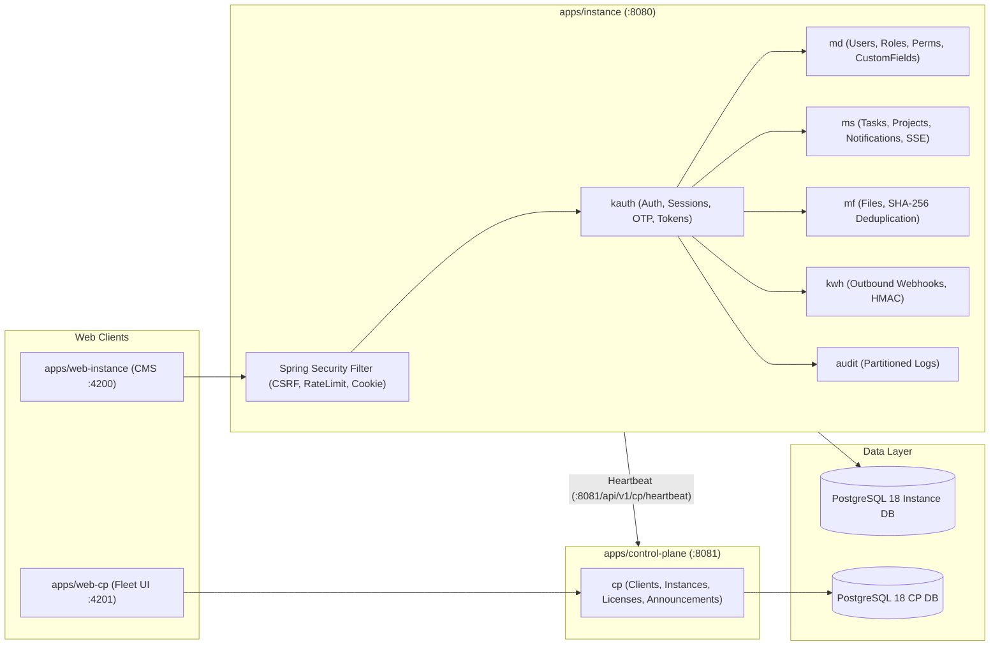

# Карта статистик проекта (Project Statistics Map)

**Дата генерации:** 2026-08-29  
**Репозиторий:** `dwh-platform` (Enterprise Multi-Tenant SaaS)  
**Ветка:** `main`  
**Метод сбора:** утилита `scripts/calc-stats.ps1`, Maven Surefire Report, git logs.

---

## 1. Общая структура монорепозитория

| Директория | Назначение | Ключевые точки входа |
| :--- | :--- | :--- |
| `libs/core-types/` | Базовые типы, RFC 9457 `ProblemDetailRecord`, Keyset пагинация, каталог `ErrorCode` (35 кодов) | `com.greenwhite.dwh.core.*` |
| `libs/provider-spi/` | Интерфейсы Service Provider Interface (Storage, Mail, SMS, Messenger) | `com.greenwhite.dwh.spi.*` |
| `apps/instance/` | Модульный монолит клиентского инстанса (`md`, `kauth`, `ms`, `mf`, `audit`, `kwh`, `search`) | `InstanceApplication.java` (порт 8080) |
| `apps/control-plane/` | Центральный сервис управления флотом инстансов, лицензиями и объявлениями | `ControlPlaneApplication.java` (порт 8081) |
| `apps/web-instance/` | Frontend CMS клиентского инстанса на Angular 22 (Signals, Standalone, UI-Kit) | `main.ts` -> `app.component.ts` (порт 4200) |
| `apps/web-cp/` | Frontend Control Plane дашборд флота на Angular 22 | `main.ts` -> `app.component.ts` (порт 4201) |
| `docs/` | Архитектурные спецификации, ADR (12 шт), TRD (4 шт), планы ремедиации и аудиты | `docs/trd/TRD-01-cms.md` |
| `deploy/` | Скрипты и манифесты развёртывания (Nomad, Consul, Vault, Docker Compose) | `deploy/compose/docker-compose.prod.yml` |
| `scripts/` | Инструменты автоматизации, E2E тесты, генерация статистики | `scripts/test-api.ps1`, `scripts/calc-stats.ps1` |

---

## 2. Технологический стек и топ-зависимости

- **Языки и рантайм:** Java 25 (LTS), TypeScript 5.8, SQL (PostgreSQL 18 диалект), HTML5/CSS3.
- **Backend Framework:** Spring Boot 4.1.1 (Spring Framework 7), Spring Security 4.1.1.
- **Frontend Framework:** Angular 22.1.4 (Zoneless Signals, Standalone Components).
- **Базы данных:** PostgreSQL 18.6 Alpine, Flyway 11.

### Топ-10 библиотек и назначение:
1. `spring-boot-starter-webmvc` (4.1.1) — HTTP REST API контроллеры и SSE эндпоинты.
2. `spring-boot-starter-security` (4.1.1) — CSRF Double-Submit защита, Security Headers, аутентификация.
3. `spring-boot-starter-jdbc` (4.1.1) — Высокопроизводительный `JdbcClient` без накладных расходов ORM.
4. `org.postgresql:postgresql` (42.7.5) — JDBC драйвер с поддержкой JSONB и PostgreSQL 18.
5. `org.flywaydb:flyway-core` (11.x) — Миграции структуры и данных базы данных.
6. `de.mkammerer:argon2-jvm` (2.11) — Криптостойкое хеширование паролей Argon2id (`m=65536, t=2, p=2`).
7. `com.bucket4j:bucket4j-core` (8.10.1) — Распределенный и локальный Rate Limiting (Token Bucket).
8. `com.tngtech.archunit:archunit-junit5` (1.3.0) — Архитектурный контроль модульных границ и запрет циклов.
9. `org.testcontainers:postgresql` (1.21.3) — Интеграционные тесты на реальном PostgreSQL 18 в Docker.
10. `tools.jackson.core:jackson-databind` (3.x) — Высокоскоростная сериализация JSONB и ProblemDetail.

---

## 3. Метрики исходного кода

```
Extension       Files    Lines of Code
--------------------------------------
.java (Backend)   167           10,172
.ts (Frontend)     45            5,542
.md (Docs/Specs)   44            5,508
.sql (Migrations)   7              709
.yml (Config)       8              502
.xml (POM)          5              407
.css / .html        4              372
--------------------------------------
TOTAL             280           22,712 (без вендорных lock-файлов)
```

---

## 4. Тестовое покрытие и верификация

- **Фреймворки:** JUnit 5, Mockito, Spring Boot Test, Testcontainers (PostgreSQL 18), ArchUnit.
- **Общее количество тестов:** **61 тест** (100% проходят успешно).
  - `libs/core-types`: 2 теста (Keyset пагинация, утилиты курсоров).
  - `apps/instance`: 58 тестов (Security Config, CSRF, Rate Limiting, RBAC Integration, User Blocking Invariant, Password Validator & Hasher, Phone Uniqueness, Anonymization, Flyway Migrations, Webhook HMAC, SSE Registry, Task Aggregates, Search, File Streaming).
  - `apps/control-plane`: 1 тест (Flyway Script Integrity).
- **Команда запуска всех тестов:**
  ```bash
  mvn test
  ```


---

## 5. Архитектурная схема взаимодействия



---

## 6. Backlog оптимизаций и улучшений (по приоритетам)

1. **P0 (Круг 1 — Ядро доступа M2–M4):**
   - M2: Добавить проверку паролей по словарю распространённых паролей (blacklist) и валидацию уникальности телефонов.
   - M3: Реализовать эндпоинт управления сессиями всех пользователей для администратора и таймер автозакрытия сессий (12 ч).
   - M4: Реализовать сканер `@RequiresPermission` для автоматической синхронизации каталога форм из кода.
2. **P1 (Круг 2 — Сквозные контракты M8, M10, M9):**
   - M8: Сквозная расстановка вызовов `AuditService` во все мутирующие операции сервисов.
   - M10: Внедрение перехватчика `Idempotency-Key` на основе таблицы `idempotency_keys`.
   - M9: Вынесение текстов UI во внешние JSON-словари i18n (`ru`, `uz`, `en`).
3. **P2 (Круг 3 — Бизнес-функции M5–M7, M16–M18):**
   - M7: Подключение S3 Garage Storage Provider.
   - M6: Подключение боевых шлюзов SMS / SMTP.
   - M18: Экран мониторинга и повторной отправки dead-letter вебхуков.
