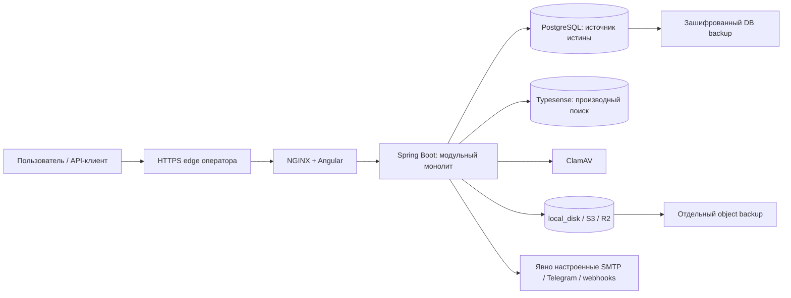

# SmartupCMS: CTO-аудит и план подготовки релиза

> Архивный непроверенный черновик. Сохранён в Git по запросу пользователя
> 2026-09-08; публикация не подтверждает выводы, результаты проверок или
> актуальность находок. Не использовать как требования или release evidence.

Дата: 2026-09-05. База: `main`, commit `710efeb55c03c2d444cfc8fd22dcefa01635e99c`.
Статус: локальный аналитический отчёт, не изменение ТЗ и не production acceptance.
Runtime-код, миграции, данные и production-конфигурация в рамках аудита не изменялись. Коммит, push и deploy не выполнялись.

## 1. Executive summary

1. **Готовность к production: Нет.** Наличие CI и тестов не закрывает найденные дефекты доступа и восстановления.
2. Сохранять модульный монолит и одну организацию на установку: это соответствует принятому ADR-0014 и заявленному масштабу.
3. Экспорт задач обходит row-level scope, хотя обычные task/file API его применяют: первоочередной security blocker S-01.
4. Production Compose использует одну DB-роль для приложения и миграций; локально эта роль — superuser: S-02.
5. Входящий X-Forwarded-For может определять ключ IP rate limit без проверки доверенного прокси: S-03.
6. Общий idempotency filter сохраняет JSON ответа, включая исходный API-токен на endpoint его создания: S-04.
7. Проверка «есть данные» через наличие контейнера пропускает сохранённый PostgreSQL volume; DB/object backups не образуют согласованную точку: D-01/D-02.
8. Release pipeline подписывает образы, но его граф зависимостей не требует E2E и vulnerability scan именно выпускаемого артефакта: D-03.
9. Полный backend verify сегодня не подтверждён из-за недоступного Ryuk; frontend 107/107, typecheck и production build прошли.
10. Реалистичный объём выделенного backlog: **33–58 человеко-дней**, с резервом 25% — примерно **42–73**. Это оценка работ, не измеренная стоимость всего долга.
11. Четыре месяца позволяют выполнить план при выделенной ёмкости команды и доступном staging; точная дата, бюджет и SLO не подтверждены.
12. Не добавлять Kubernetes, Kafka, Redis, мультиарендность или новые микросервисы до доказанного ограничения существующей модели.

Доказательства и ограничения каждого вывода находятся ниже и в специализированных отчётах:

- [Архитектура](D:/Claude/dwh/audit/architecture-2026-09-05.md).
- [Производительность и SQL](D:/Claude/dwh/audit/performance-2026-09-05.md).
- [Безопасность / OWASP / ISO](D:/Claude/dwh/audit/security-2026-09-05.md).
- [DevOps, релиз и восстановление](D:/Claude/dwh/audit/devops-2026-09-05.md).

## 2. Контекст и карта системы

| Слой | Подтверждённое состояние | Первичный артефакт |
|---|---|---|
| Продукт | Open-source Apache-2.0 платформа контента и операционной работы; отдельная установка, БД и storage для одной организации | [ТЗ, раздел 1](D:/Claude/dwh/docs/technical-specification.md:18), [LICENSE](D:/Claude/dwh/LICENSE), [ADR-0014](D:/Claude/dwh/docs/adr/ADR-0014-unified-open-source-runtime.md:21) |
| Web | Angular 22.1.4, TypeScript 6, RxJS, Angular CDK/Material; lazy-loaded страницы | [package.json](D:/Claude/dwh/apps/web/package.json:17), [routes](D:/Claude/dwh/apps/web/src/app/app.routes.ts:22) |
| Server | Java 25, Spring Boot 4.1.1; SQL-first JdbcClient; один JVM runtime | [pom.xml](D:/Claude/dwh/pom.xml:15), [ADR-0002](D:/Claude/dwh/docs/adr/ADR-0002-backend-stack.md) |
| Библиотеки | core-types, platform-common, provider-spi; не отдельные сервисы | [Maven modules](D:/Claude/dwh/pom.xml:40) |
| Модули | kauth — auth; md — организация/IAM/settings/i18n; ms — задачи/комментарии/уведомления; mf — файлы; audit; kwh — webhooks; search; report | [server source](D:/Claude/dwh/apps/server/src/main/java/com/greenwhite/dwh/instance), [architecture test](D:/Claude/dwh/apps/server/src/test/java/com/greenwhite/dwh/instance/architecture/ModularArchitectureTest.java:39) |
| Данные | PostgreSQL 18, Flyway V001–V024; Typesense — производный индекс; local_disk/S3 — байты файлов | [PostgreSQL image](D:/Claude/dwh/deploy/images/postgres/Dockerfile:4), [миграции](D:/Claude/dwh/apps/server/src/main/resources/db/migration), [storage SPI](D:/Claude/dwh/libs/provider-spi/src/main/java/com/greenwhite/dwh/spi/storage) |
| Production | Single-host Compose: web, server, postgres, typesense, ClamAV, backup; отдельные migrate и backup-bootstrap | [Compose](D:/Claude/dwh/deploy/compose/docker-compose.prod.yml:59) |
| Интеграции | Managed: Cloudflare edge + R2; self-hosted: проверенный S3/local provider. SMTP/Telegram и webhooks включаются явно | [ТЗ](D:/Claude/dwh/docs/technical-specification.md:55), [application.yml](D:/Claude/dwh/apps/server/src/main/resources/application.yml:85) |

Критические пути: вход/смена bootstrap-пароля → серверные permissions и scope → задача/комментарий/вложение; загрузка → quarantine → scanner → публикация metadata; изменение данных → audit + уведомления + поиск; настройки/переводы → сохранение и обновление UI. Экспорт — отдельный путь чтения, который нельзя считать безопасным лишь потому, что защищена карточка задачи. Артефакты: [ТЗ FR-AUTH, FR-TASK, FR-FILE, FR-ADMIN](D:/Claude/dwh/docs/technical-specification.md), [MfFileService](D:/Claude/dwh/apps/server/src/main/java/com/greenwhite/dwh/instance/mf/service/MfFileService.java:42), [ReportController](D:/Claude/dwh/apps/server/src/main/java/com/greenwhite/dwh/instance/report/controller/ReportController.java:21).

Локально: скопировать `.env.example` в `.env`, настроить значения, `docker compose run --rm migrate`, `docker compose up -d --wait`; UI — `http://localhost:4200`. Проверки исходников: `mvn -B verify`, в web — `npm ci`, `npm test`, `npm run typecheck`, `npm run build`. Это документированный путь, а не утверждение о новом clean install сегодня: [README](D:/Claude/dwh/README.md), [CI](D:/Claude/dwh/.github/workflows/ci.yml).

Плановые 100 установок / 500 пользователей / 100 активных / 50 ГБ файлов в месяц относятся **ко всему парку**, не к каждой установке. На один instance нельзя переносить эти цифры без распределения пиков: [ТЗ:42](D:/Claude/dwh/docs/technical-specification.md:42). Встроенная multi-host HA явно исключена [ADR-0014:36](D:/Claude/dwh/docs/adr/ADR-0014-unified-open-source-runtime.md:36).

## 3. Метод и фактические проверки

Проверены контекст, docs index, ТЗ, текущие ADR, production/local Compose, Dockerfiles, CI/release/DCO workflows, backup/restore/deploy и acceptance scripts; затем входные точки auth/access, task/export/file/search/idempotency/outbox, SQL и тесты. Graphify использован для навигации, факты сверялись по исходникам. Это широкая статическая проверка с выборочной динамической валидацией, **не исчерпывающий pentest, не нагрузочная сертификация и не просмотр каждого UI-элемента**.

| Проверка 2026-09-05 | Результат / предел доказательства |
|---|---|
| Git status / HEAD | main; исходники не изменены. Dirty graphify-out и output существовали до аудита |
| `docker compose ps` | postgres/server/typesense/web running, healthy. Это development topology без production scanner/backup |
| Read-only SQL `pg_roles` | текущая локальная DB-роль `dwh`: rolsuper/rolcreatedb/rolcreaterole = true; production host не опрашивался |
| Read-only DB inventory | 67 public tables, 24 Flyway records; всего 9 задач. Нерепрезентативный dataset |
| `EXPLAIN (ANALYZE, BUFFERS, TIMING OFF)` | поиск задач `%audit%`: Seq Scan по 9 строкам, execution 0.221 ms; не доказательство production latency — [подробности](D:/Claude/dwh/audit/performance-2026-09-05.md) |
| Frontend `npm test` в pinned Node 24.15.0 | **107 passed / 31 test files**, exit 0 |
| Web typecheck + production build в том же Node | exit 0; initial bundle 476.61 kB raw / 126.31 kB estimated transfer. Это оценка сборщика, не измеренная загрузка страницы |
| Host `npm test` | не стартует: локальный Node 24.14.0 ниже требуемого 24.15.0; тесты подтверждены контейнерным runtime, host не обновлялся |
| Backend `mvn -B -q verify` в Maven/Java 25 container | два запуска неуспешны: 216 tests, 0 assertion failures, 10 errors, 15 skipped; Ryuk недоступен через host.docker.internal и bridge gateway. **Не зелёный backend** |
| ArchUnit в том же прогоне | 9 tests, 0 errors/failures/skipped: [surefire XML](D:/Claude/dwh/apps/server/target/surefire-reports/TEST-com.greenwhite.dwh.instance.architecture.ModularArchitectureTest.xml) |
| Architecture/release/config/docs contracts | отдельные команды завершились успешно; docs contract: 19 required files, 100 Markdown files. Не доказательство поведения удалённого release |
| Gitleaks 8.28.0, последние до 100 commits, explicit repo config/ignore | 97 commits, exit 1, один исторический test-container fixture с несовпадающим путём исключения; не подтверждённый production credential — S-07 |
| Trivy 0.74.0, обновлённая vulnerability DB | 0 HIGH/CRITICAL, включая unfixed, в свежем backend CycloneDX SBOM и web/E2E lockfiles; dev dependencies включены. Для стороннего SBOM scanner предупреждает о полноте обнаружения и неподдерживаемых дополнительных hash algorithms |
| E2E, runtime image CVE scan, 100-user load, R2/edge/DR drills | в этом аудите не выполнены. Предыдущие записи CI в docs не заменяют свежего release evidence |

Первый неуспешный запуск Maven использовал явный host override; во втором override удалён, но ошибка подключения сохранилась. Не отключались Ryuk, security checks или обязательные тесты ради зелёного результата. Генерируемые `target/`, `dist/` и scanner report — локальные диагностические артефакты, не новые требования.

## 4. Release blockers (P0)

P0 означает «закрыть до production», а не «подтверждён инцидент». Приоритет отделён от severity и вероятности эксплуатации.

| ID | Наблюдение → риск | Доказательство | Минимальное действие и приёмка | Усилие |
|---|---|---|---|---|
| S-01 | Export без scope → раскрытие чужих задач внутри организации ограниченной роли | [ReportController:21](D:/Claude/dwh/apps/server/src/main/java/com/greenwhite/dwh/instance/report/controller/ReportController.java:21), [ReportService:45](D:/Claude/dwh/apps/server/src/main/java/com/greenwhite/dwh/instance/report/service/ReportService.java:45) | Передать current user + тот же ScopeFilter в оба формата; SELF/UNITS/SUBTREE/ALL API tests, скрытая задача не попадает в bytes | S/M |
| S-02 | Общая privileged DB-role runtime/migrate → компрометация приложения получает DDL и контроль аудита | [Compose:8](D:/Claude/dwh/deploy/compose/docker-compose.prod.yml:8), [Compose:65](D:/Claude/dwh/deploy/compose/docker-compose.prod.yml:65), read-only pg_roles | Разделить bootstrap/migrate/runtime/backup; runtime NOSUPERUSER/NOCREATEDB/NOCREATEROLE; DDL/TRUNCATE/отключение audit triggers запрещены тестами | M |
| S-03 | Непроверенный первый XFF → обход IP-bucket, подмена security IP; карта bucket не имеет жёсткой границы | [NGINX:44](D:/Claude/dwh/apps/web/nginx.conf:44), [RateLimitFilter](D:/Claude/dwh/apps/server/src/main/java/com/greenwhite/dwh/instance/config/security/RateLimitFilter.java), [RateLimitService](D:/Claude/dwh/apps/server/src/main/java/com/greenwhite/dwh/instance/config/security/RateLimitService.java) | Единая политика trusted proxy, canonical IP и bounded buckets; spoofed XFF не меняет identity, N+1 даёт 429 | M |
| S-04 | Idempotency сохраняет response JSON credential endpoints → plaintext API-token в другой таблице | [Filter:111](D:/Claude/dwh/apps/server/src/main/java/com/greenwhite/dwh/instance/config/idempotency/IdempotencyFilter.java:111), [token service:59](D:/Claude/dwh/apps/server/src/main/java/com/greenwhite/dwh/instance/kauth/service/KauthApiTokenService.java:59) | Исключить credential/auth/upload endpoints или ограничить idempotency allow-list; тест создания токена с ключом не находит raw token в БД/backup response cache | M |
| D-01 | Контейнер отсутствует, volume сохранён → deploy пропускает mandatory backup | [deploy.ps1:28](D:/Claude/dwh/scripts/prod/deploy.ps1:28), [deploy.sh:28](D:/Claude/dwh/scripts/prod/deploy.sh:28) | Проверять persistent state, явный empty-install path; fail closed для неизвестного состояния; disposable down без volumes → повторный deploy обязан резервировать данные | M |
| D-02 | Независимые DB и object snapshots → неудовлетворённая точка восстановления | [acceptance guide:171](D:/Claude/dwh/docs/ops/managed-infrastructure-acceptance.md:171), [object backup:86](D:/Claude/dwh/scripts/prod/backup-objects.ps1:86) | Короткое подтверждённое окно без записей либо versioned manifest; общий capture ID, restore с checksum и сверкой bytes↔DB, измеренные RPO/RTO | M |
| D-03 | Подписанный release не зависит от E2E/security gate точного выпускаемого артефакта | [release.yml:15](D:/Claude/dwh/.github/workflows/release.yml:15), [release.yml:78](D:/Claude/dwh/.github/workflows/release.yml:78) | Release-specific E2E+scan всех digests, проверка signature/SBOM/provenance на target; отрицательная проверка блокирует publish/deploy | M |
| D-04 | Нет подтверждённой target acceptance/SLO/RPO/RTO; нет hard resource limits в production Compose | [ТЗ AC-12](D:/Claude/dwh/docs/technical-specification.md:230), [Dockerfile:61](D:/Claude/dwh/Dockerfile:61), [Compose](D:/Claude/dwh/deploy/compose/docker-compose.prod.yml) | Назначить владельцев, лимиты, пороги; пройти edge/R2/scanner/load/restore/alerts на target, приложить evidence к digest | M/L, зависит от доступа |

## 5. Risk register

Вероятность — качественная экспертная оценка условий, не статистика инцидентов. «Неизвестна» не означает низкую вероятность.

| Риск | Вероятность / влияние | Mitigation / владелец |
|---|---|---|
| Межролевое раскрытие задач через экспорт | Высокая при наличии scoped roles / высокое | S-01; Backend + QA |
| Полный контроль БД при компрометации server | Вероятность компрометации неизвестна, privileged role подтверждена / критическое | S-02; Backend + DBA/DevOps |
| Подмена IP и рост limiter memory | Высокая при доступном ненормализованном ingress / высокое | S-03; DevOps + Backend |
| Утечка raw API token через response cache / backup | Условная: credential POST с Idempotency-Key / высокое | S-04; Backend |
| Потеря файлов после формально успешного DB restore | Средняя при live backup/delete / критическое | D-01/D-02; DevOps |
| Публикация уязвимого/непроверенного release image | Неизвестна / высокое | D-03; Release owner |
| Потерянные/устаревшие результаты поиска | Средняя: async до commit или сбой Typesense / среднее | A-02; Backend |
| Lost update задачи при параллельном редактировании | Средняя при совместной работе / среднее | A-03; Backend + Web |
| OOM/долгие ответы из-за upload/export/reindex | Неизвестна без dataset и soak / высокое | P-03/P-04/D-04; Backend + DevOps |
| Остановка одного host | Частота неизвестна / простой всех установок на нём | Backups/restore, принятый single-host SLO; не обещать HA |
| Невыполнение требований клиента по privacy/ISO | Неизвестна: договоры и юрисдикции не предоставлены / высокое | S-08; владелец безопасности/продукта |

## 6. Инвестиционный backlog и оценка долга

Оценка снизу вверх, после статического аудита. День = 8 рабочих часов, включает реализацию и соответствующие тесты; ожидание внешних доступов не включено. Диапазоны нельзя суммировать повторно со специализированными finding estimates: ниже **непересекающиеся пакеты работ**.

| Пакет | Содержание / класс долга | P | Чел.-дни | Что даёт исправление / ROI-driver |
|---|---|---|---:|---|
| I-01 | Scope экспортов + CSV hardening + негативные API tests; безопасность | P0/P1 | 2–4 | Устраняет подтверждённый путь раскрытия данных |
| I-02 | DB role split, grants и audit maintenance boundary; безопасность/инфраструктура | P0 | 3–5 | Ограничивает blast radius приложения |
| I-03 | Trusted IP, bounded limiter, mixed-auth CSRF test; безопасность/код | P0/P1 | 2–4 | Защищает вход и корректность журналов |
| I-04 | Idempotency allow-list, secret exclusion, crash recovery/retention и лимиты body; код/надёжность | P0/P1 | 3–6 | Не сохраняет секреты, предотвращает зависшие/повторные операции |
| I-05 | Volume-aware deploy, согласованный backup, previous digest и restore drill; инфраструктура | P0 | 5–8 | Снижает риск потери данных и время восстановления |
| I-06 | Release gates точных digests, secret-history fixture, DCO; supply chain/зависимости | P0/P1 | 3–5 | Подписывается проверенный артефакт, меньше ручной приёмки |
| I-07 | AFTER_COMMIT + durable search retry, batch reconcile/startup; архитектура/код | P1 | 3–5 | Поиск догоняет источник без рестарта и не тормозит запуск |
| I-08 | Auth SQL, duplicate indexes, task optimistic concurrency; код/данные | P1 | 3–6 | Меньше DB round trips/WAL, нет тихого lost update |
| I-09 | Resource profile, upload/export budgets, dataset/load/soak, dashboards и drills; performance/инфраструктура | P0/P1 | 6–10 | Определяет реальную ёмкость и стоимость установки |
| I-10 | Точечные проверки качества, сверка документации с интерфейсами, приложение по приватности и эксплуатации, остаточные меры защиты webhook | P1/P2 | 3–5 | Поддерживаемая релизная дисциплина; юридическое согласование оценивается отдельно |
| **Итого** | Без новых продуктовых функций и без миграции на микросервисы | | **33–58** | |

Резерв неопределённости 25%: 41.25–72.5 дня, округлённо **42–73**. Финансовая модель: 330–580 часов × ваша fully-loaded ставка `R`. **Иллюстрация, не рыночная котировка:** при R=$25–50/час диапазон **$8 250–29 000**. Хостинг, лицензии внешних сервисов, налог, внешний pentest, юридическая работа и ISO-сертификация сюда не включены.

ROI считать как `(снижение ожидаемого ущерба + экономия часов × R − инвестиция) / инвестиция`. Стоимость инцидента, вероятность, ARR, margin и фактическая стоимость поддержки отсутствуют: денежный ROI в процентах сейчас был бы выдумкой.

Для операционной автоматизации можно измерить окупаемость без выдуманной вероятности: экономия `N установок × K обновлений × Δt минут / 60`. Например, **условные** 10 минут экономии на 100 установках дают 16.7 часа на цикл; это не замер текущего процесса. Для индексов и SQL сначала зафиксировать DB CPU/WAL/IO и p95, затем сравнить до/после; не обещать процент ускорения заранее.

Стоимость инфраструктуры считать отдельно: число установок × измеренный baseline server+DB+Typesense+scanner + shared-host overhead + object/backup retention + операторские часы. 50 ГБ/месяц — прирост загрузок, **не общий объём хранения**. При условном отсутствии удаления это около 600 ГБ за 12 месяцев до учёта дедупликации/backup. Повторные полные object backups могут существенно умножить объём; [backup-objects](D:/Claude/dwh/scripts/prod/backup-objects.ps1) обходит все объекты, а не только дельту. Цены Hetzner/Cloudflare не проверялись и не использованы.

## 7. Дорожная карта на четыре месяца

Недели относительные, от согласованного старта. Зависимости важнее календарной даты. При двух инженерах и среднем выделении 50% ёмкости за 16 недель доступно 80 человеко-дней; это **условие выполнимости**, не сведения о вашей команде.

| Период | Последовательность | Проверяемый выход |
|---|---|---|
| Неделя 1 | S-01 exports → S-04 secret cache; сначала негативные тесты | Scoped user не получает чужие строки/bytes; raw secrets не сохраняются в idempotency |
| Неделя 2 | S-03 proxy/limiter; старт S-02 роли БД; согласование SLO/data owner | Spoof test и bounded-memory test; утверждённый проект grants; владельцы неизвестных |
| Недели 3–4 | Завершить S-02; D-01 volume-aware deploy; D-02 согласованный backup | Runtime лишён DDL; сохранённый volume не пропускает backup; первый isolated combined restore |
| Недели 5–6 | D-03 release gates и previous-digest state; A-02 search lifecycle | Нельзя publish при красном scan/E2E; сбой search догоняется автоматически |
| Недели 7–8 | P-01/P-02 SQL, A-03 concurrency, I-04 crash scenarios | До/после SQL budget; duplicate indexes устранены безопасной миграцией; stale write → 409 |
| Недели 9–12 | I-09 target profiles, 100-user distribution, upload/4h soak, alerts/DR | Dataset+digest+полное окно метрик; RPO/RTO и on-call delivery доказаны |
| Недели 13–14 | Privacy/retention annex, API/docs, точечные тестовые пробелы, RC | Закрытая матрица требований и владельцев; полный fresh release evidence |
| Недели 15–16 | Согласованный пилот, повтор upgrade/restore, резерв на дефекты, go/no-go | Все P0 закрыты, остаточные P1 приняты владельцами письменно |

Параллельно допустимы независимые code и infrastructure workstreams. Не начинать оптимизацию SQL вместо исправления утечки экспортов. Первые недели ограничить изменения критическими потоками; затем сохранять отдельный небольшой бюджет на продуктовые изменения, не расширяя текущую release scope.

## 8. Definition of Done для релиза

- [ ] Все P0 выше закрыты конкретными regression tests и review; нет обхода scope через export/aggregate/direct API.
- [ ] Runtime DB-role не superuser, не владеет схемой; не может DDL/TRUNCATE/disable audit; миграции и partition maintenance работают отдельным разрешённым путём.
- [ ] Cookie/Bearer/CSRF и trusted-proxy матрица проходят; limiter имеет hard bound.
- [ ] Raw API/OTP/reset/webhook secrets не попадают в response cache, audit или diagnostic artifacts; исторические копии оценены отдельно.
- [ ] Fresh backend verify и frontend suite/typecheck/build зелёные без обязательных skipped tests; E2E зелёные на release topology.
- [ ] Every released digest прошёл scan и target signature/provenance/SBOM verification; необработанных HIGH/CRITICAL нет либо есть формальное ограниченное исключение с владельцем/сроком.
- [ ] Empty install, upgrade из предыдущего release, retained-volume redeploy и failed-backup negative test пройдены.
- [ ] DB+object restore сверяет inventory, размеры и hashes с metadata и sample downloads; фактические RPO/RTO укладываются в утверждённые цели.
- [ ] Для target утверждены числовые p95/p99/error/availability/saturation и пройден полный load/soak без missing/orphan objects.
- [ ] HTTPS edge, origin lockdown, R2 private access, fail-closed scanner и alert delivery подтверждены с target.
- [ ] Есть владелец incident/rollback/go-no-go, off-host recovery material и заполненный privacy/retention annex.
- [ ] Поддерживаемая single-host модель и границы HA явно указаны; ISO-соответствие не заявляется без организационных доказательств.

## 9. Неизвестные и вопросы по одному

Эти сведения не найдены/не подтверждены в предоставленных артефактах: фактическая команда и ставка; точная дата запуска; распределение активных пользователей между установками; типовой/максимальный dataset; целевые p95/p99/availability; утверждённые RPO/RTO; staging/production domain и конфигурация Cloudflare/R2; владельцы on-call и recovery keys; retention, юрисдикции, договорные требования и область ISMS/SoA; branch/tag protection и актуальные опубликованные release artifacts.

**Первый вопрос для уточнения плана:** сколько людей реально могут работать над подготовкой релиза ближайшие четыре месяца, каковы их роли (backend, frontend, QA, DevOps) и какая доля рабочего времени каждого доступна? Остальные вопросы следует задавать последовательно, после ответа.
